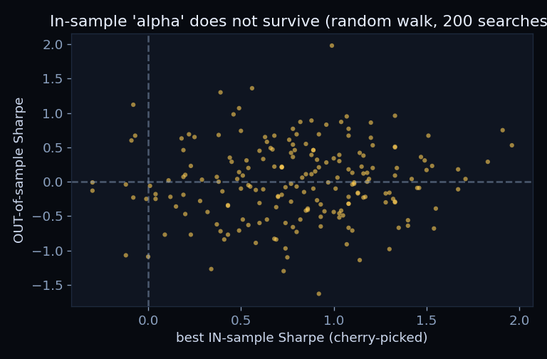
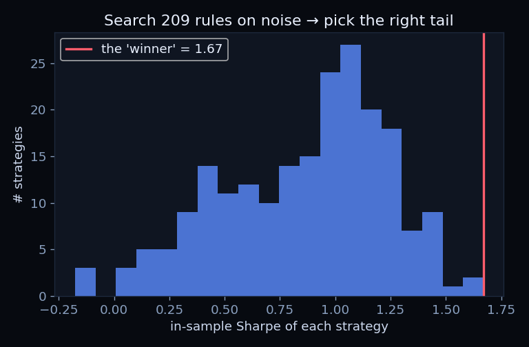
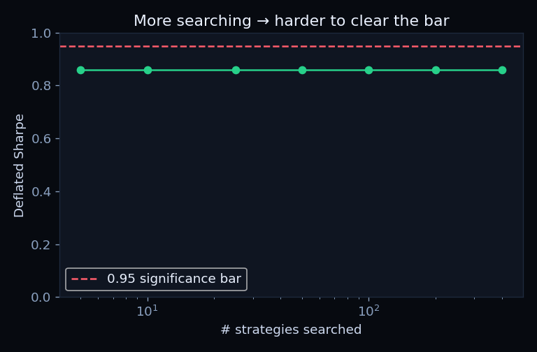

# 🎰 alpha-mirage — the backtest casino

[](https://github.com/danielduongg/alpha-mirage/actions)

How easy is it to "discover" a winning trading strategy that is **pure luck**? Trivially easy — and this repo lets you feel it.

### ▶️ [Live demo](https://danielduongg.github.io/alpha-mirage/)

Pull the lever: it searches hundreds of moving-average crossover rules, keeps the one with the best **in-sample** Sharpe, then tests it **out-of-sample**. Do it on a *pure random walk* (where no edge can exist by construction) and the "winner" still shows a Sharpe above 1 — then collapses to ~0.

> **Not financial advice — the exact opposite.** The lesson is that a strategy selected from its own backtest tells you almost nothing about the future.

## The finding

Searching `K` strategies and reporting the best in-sample Sharpe is **multiple-hypothesis testing**. The more rules you try, the higher the best in-sample Sharpe climbs — even on noise. Averaged over many random seeds (K = 200 rules):

| Data | Best in-sample Sharpe | Out-of-sample Sharpe | Deflated Sharpe |
|---|---|---|---|
| Pure random walk (no edge) | ~0.75 | **~0.08** | **~0.42** |
| Market-like noise | ~0.80 | ~0.11 | ~0.43 |

The **Deflated Sharpe Ratio** (Bailey & López de Prado, 2014) prices in the number of trials, the track-record length, and the skew/kurtosis of returns. Below ~0.95 it's statistically indistinguishable from luck — and the casino's "winners" never clear the bar.

## Results





Across 200 independent searches on pure random walks, the in-sample "winner" Sharpe and its out-of-sample Sharpe correlate ~**0.07** — i.e., not at all. The deflated Sharpe falls as you search more rules.

## Tests & CI

`pytest` asserts the mirage reproduces: in-sample beats out-of-sample by a wide margin, out-of-sample Sharpe ≈ 0 on a random walk, and the Deflated Sharpe never clears 0.95. GitHub Actions runs it on every push.

## Method

- `experiment.py` — simulates returns, runs the MA-crossover grid search, computes in-sample vs out-of-sample Sharpe, the expected-maximum Sharpe under the null, and the Deflated Sharpe Ratio; aggregates over 30 seeds.
- `index.html` — a fully client-side re-run of the same experiment (seeded RNG, grid search, deflated Sharpe with an Acklam inverse-normal); the in-browser numbers reproduce the Python experiment's statistics.

## Run it

```bash
pip install -r requirements.txt
python experiment.py
```
